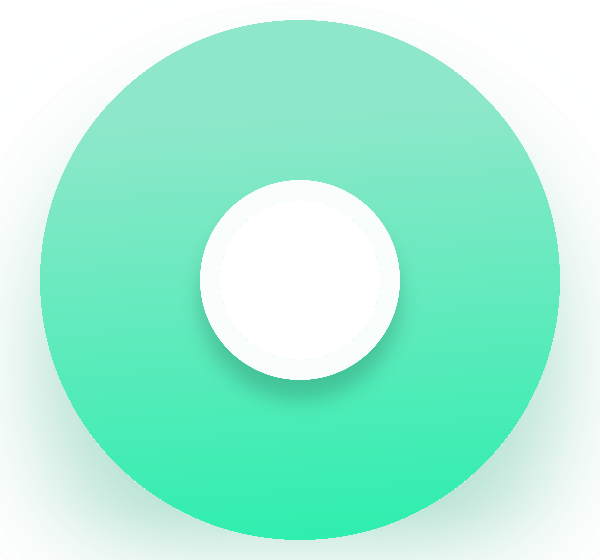
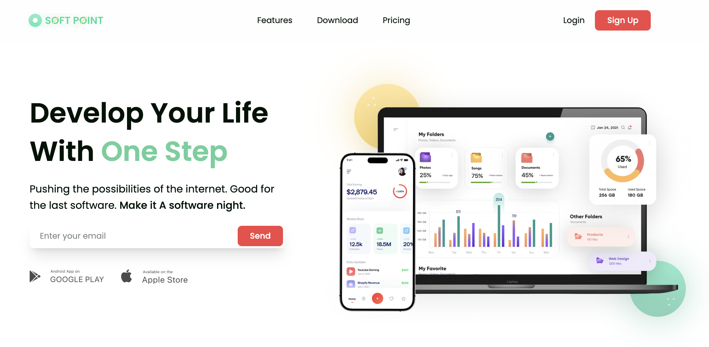
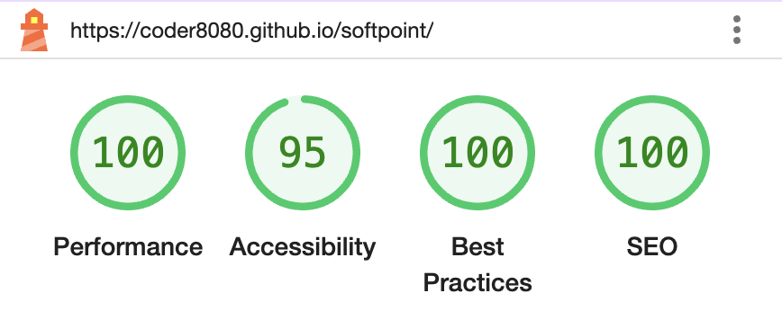

<a id="readme-top"></a>

<div align="center">

[](https://tailwindcss.com)
[](https://coder8080.github.io/softpoint)
[](https://github.com/coder8080/softpoint/actions)
[](https://docker.com)

  

  <h3 align="center">SoftPoint</h3>

  <p align="center">
    Site for B2B software company
    <br />
    <a href="https://coder8080.github.io/softpoint/">View on Github Pages</a>
  </p>
</div>


## About The Project

[](https://coder8080.github.io/softpoint/)
[](https://coder8080.github.io/softpoint/)

Built from [figma](https://www.figma.com/design/I7Y2VDqbXYD5sZLF7mk92y/Soft-Point). Performant, accessible, adaptive, SEO-optimized.

<p align="right">(<a href="#readme-top">back to top</a>)</p>


## Getting Started

To get a local copy up and running follow these steps.

### Prerequisites

* node >= 22
* [Docker](https://www.docker.com)

### Development mode

#### Steps

1. Clone the repo
   ```sh
   git clone https://github.com/coder8080/softpoint.git
   ```
2. Install packages
   ```sh
   npm install
   ```
3. Run project in development mode
   ```sh
   npm run dev
   ```

Site will be available at [http://localhost:3000/softpoint](http://localhost:3000/softpoint)

<p align="right">(<a href="#readme-top">back to top</a>)</p>


## Production mode

1. Clone the repo
   ```sh
   git clone https://github.com/coder8080/softpoint.git
   ```
2. Install packages
   ```sh
   npm install
   ```
3. Run project in development mode
   ```sh
   npm run start
   ```

Site will be available at [http://localhost:3000/softpoint](http://localhost:3000/softpoint)

<p align="right">(<a href="#readme-top">back to top</a>)</p>


## License

Distributed under the GPL-3.0 License. See [LICENSE](LICENSE) for more information.

<p align="right">(<a href="#readme-top">back to top</a>)</p>


## Contact

Roman Kolerov - [@coder8080](https://t.me/coder8080) - coder8080@yandex.ru

Project Link: [https://github.com/coder8080/softpoint](https://github.com/coder8080/softpoint)

<p align="right">(<a href="#readme-top">back to top</a>)</p>


## Acknowledgments

* [Figma template](https://www.figma.com/design/I7Y2VDqbXYD5sZLF7mk92y/Soft-Point)
* [README template](https://github.com/othneildrew/Best-README-Template)
* [IPhone frame asset](https://www.vecteezy.com/png/42538623-white-smartphone-mockup-blank-screen-isolated-on-transparent-background-png-smartphone-mockup-frame)

<p align="right">(<a href="#readme-top">back to top</a>)</p>
